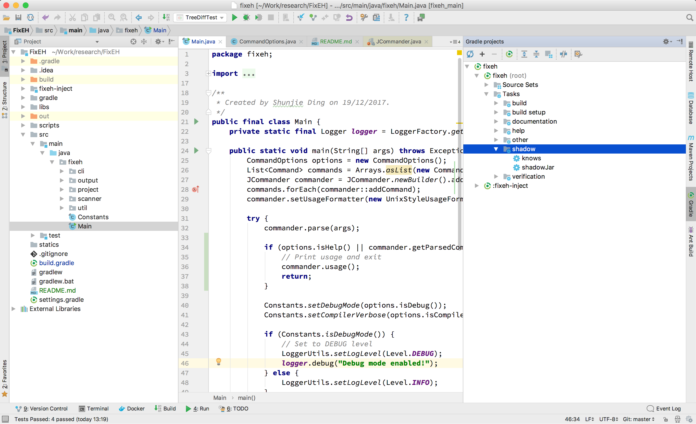

# FixEH (Exception Handling AutoFix Utils)

## Build Jars

Execute the following commands on a *nix system:

```bash
# if you have installed gradle before
gradle shadow
# or (on mac/linux)
./gradlew shadow
# or on windows
./gradlew.bat shadow # never tested
```

Or you can build it after you have imported project into Intellij IDEA.



## Usage

Print help:

```bash
$ java -jar build/libs/fixeh-0.0.1-all.jar -h
Usage: <main class> [options] [command] [command options]
  Options:
    --compiler-verbose Enable verbose mode for Spoon compiler (default: false)
    -D, --debug        Debug mode (default: false)
    -h, --help
    -v, --verbose      Verbose level (default: 0)
  Commands:
    scan      Scan projects and generate suspicious commit list or features of
            exception handling fixes in project
      Usage: scan [options]
        Options:
          --bare             Specified when VCS repo is bare (default: false)
          --build-revision   Build all java files in revision (default: false)
          -b, --build-system Build system type (gradle, eclipse, maven[✘],
                             ant[✘], auto autoDetect if unspecified) (default:
                             gradle)
          --commit           Perform suspicious scan/Perform feature scan on
                             suspicious result if '--feature' exists (default:
                             false)
          -n, --dry-run      Show details the given action (default: false)
          --enable-classpath Enable compiling with classpath for AST compiler
                             (default: false)
          --feature          Perform feature scan. (default: false)
          -k, --keywords     Keywords for suspicious scan (default: [try,
                             catch, finally, throw, exception, issue, fix,
                             bug, http, failure, crash])
          -o, --output       Output file path (default: result)
          --output-type      Output type (serialize, excel) (default: excel)
        * -p, --project-path Project path
          -t, --vcs-type     VCS type (git, svn[✘], mercurial[✘]) (default:
                             git)

    instrument      Instrument apk/jar files to inject control codes
      Usage: instrument [options]
        Options:
          --android-build-tools Android build tools version (default: 26.0.2)
          --android-sdk         Android SDK version. (default: 25)
          -o, --output          Output file name (dir), default is
                                instrumented/{filename}
        * -t, --target          Target file, should be apk/jar
        * --woven-jars          Java packages used to instrument, at least
                                provide woventools.jar

    sign      Sign (and align) with default debug keystore
      Usage: sign [options]
        Options:
          --align               Zipalign the apk (default: false)
          --android-build-tools Android build tools version, currently must be
                                25.0.0 or later (default: 26.0.2)
          -o, --output          Output file name, default is
                                {filename}-signed.apk
        * -t, --target          Target apk file

    info      Show detailed information
      Usage: info

    test      Run android instrumentation tests
      Usage: test [options]
        Options:
        * -a, --apk      Target apk file
          --class        Specify test class to run
          --force        Force execute tests (override policy configs)
                         (default: false)
          --force-sign   Force sign apk files (default: false)
          --method       Specify test method to run, must specify class at the
                         same time
          --policy-xml   Specify policy xml file
        * -b, --test-apk Test apk file
```

## Scanner

There are two major scanners you can call using CLI: one is suspicious commit scanner and another is
feature scanner.

**Suspicious Commit Scanner**

```bash
java -cp build/libs/fixeh-0.0.1-all.jar fixeh.Main scan -p /path/to/project --commit
``` 

Customize keywords:

```bash
java -cp build/libs/fixeh-0.0.1-all.jar fixeh.Main scan -p /path/to/project --commit --keywords try,catch,finally
```

**Feature Scanner**

```bash
java -cp build/libs/fixeh-0.0.1-all.jar fixeh.Main scan p /path/to/project --feature
```

Enable suspicious commit scan in feature scanner:

```bash
java -cp build/libs/fixeh-0.0.1-all.jar fixeh.Main scan p /path/to/project --feature --commit
```

## Android

### Instrument

### Sign

### Test

### Build Systems

Now supported building frameworks are gradle and eclipse, mainly for getting classpath for AST building.

1. GradleBuildSystem uses gradle tooling api to connection to a gradle daemon to initialize project building
(download jars needed) and get the classpath for building.
2. EclipseBuildSystem use .classpath file under the root of project to read classpath. So we can not guarantee that
each entry refers to a valid jar.

**Currently disabled by default, you can enable it using --enable-classpath**

## Java Options

You may encounter OutOfMemoryError when scanning a large project, try start java with the following `JAVA_OPTS`

```bash
# initial heap size 4g, max heap size 8g, max direct memory size 2g, use concurrent gc
JAVA_OPTS="-XX:InitialHeapSize=4294967296 -XX:MaxDirectMemorySize=209715200 -XX:MaxHeapSize=8589934592 -XX:MaxNewSize=1073741824 -XX:MaxTenuringThreshold=6 -XX:+UseConcMarkSweepGC -XX:+UseParNewGC"
```

## Known Issues

1. Excel output will only write the last sheet, due to the poor implementation of bingexcel.